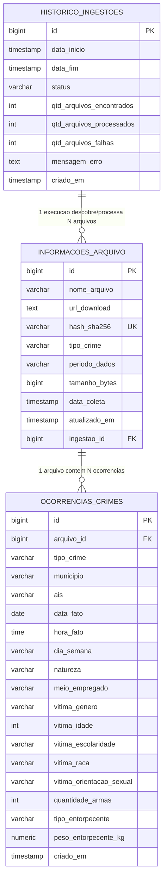

# Documentação do Banco de Dados — API Segurança SSPDS/CE

Esta documentação descreve a modelagem, o dicionário de dados, as decisões arquiteturais e as instruções para reprodução do banco de dados do projeto de dados abertos da **SSPDS/CE**.

---

## 1. Visão Geral

- **SGBD:** PostgreSQL (v15+)
- **Hospedagem:** Nuvem via [Supabase](https://supabase.com)
- **Schema Padrão:** `public`
- **Padrão de Modelagem:** Tabela unificada para ocorrências criminais (*Single Table Inheritance*) combinada com tabelas de metadados para **rastreabilidade**, **proveniência** e **observabilidade** do pipeline de dados.

---

## 2. Diagrama Entidade-Relacionamento (MER)



---

## 3. Dicionário de Dados

### 3.1. Tabela: `historico_ingestoes`
Registra cada ciclo de execução do crawler/pipeline, garantindo auditoria e monitoramento do processo diário.

| Coluna | Tipo | Nulo | Padrão | Descrição |
| :--- | :--- | :---: | :--- | :--- |
| `id` | `BIGINT` | Não | Auto-incremental | Chave primária da execução. |
| `data_inicio` | `TIMESTAMPTZ` | Não | `now()` | Data/hora de início da execução do pipeline. |
| `data_fim` | `TIMESTAMPTZ` | Sim | `NULL` | Data/hora de conclusão da rotina. |
| `status` | `VARCHAR(50)` | Não | `'EM_ANDAMENTO'` | Status atual: `'EM_ANDAMENTO'`, `'SUCESSO'` ou `'FALHA'`. |
| `qtd_arquivos_encontrados` | `INTEGER` | Não | `0` | Quantidade total de links encontrados na SSPDS. |
| `qtd_arquivos_processados` | `INTEGER` | Não | `0` | Quantidade de planilhas lidas e importadas. |
| `qtd_arquivos_falhas` | `INTEGER` | Não | `0` | Quantidade de arquivos com erro de parsing/download. |
| `mensagem_erro` | `TEXT` | Sim | `NULL` | Detalhes/stacktrace em caso de falha. |
| `criado_em` | `TIMESTAMPTZ` | Não | `now()` | Data de registro no banco. |

---

### 3.2. Tabela: `informacoes_arquivo`
Catálogo dos arquivos brutos baixados da SSPDS/CE. Garante transparência pública e controle de versão contra duplicidades e republicações.

| Coluna | Tipo | Nulo | Padrão | Descrição |
| :--- | :--- | :---: | :--- | :--- |
| `id` | `BIGINT` | Não | Auto-incremental | Chave primária do arquivo. |
| `nome_arquivo` | `VARCHAR(255)` | Não | - | Nome original do arquivo (ex: `Furto.xlsx`). |
| `url_download` | `TEXT` | Não | - | URL pública oficial de origem na SSPDS. |
| `hash_sha256` | `VARCHAR(64)` | Não | - | Hash criptográfico único (SHA-256) do arquivo. |
| `tipo_crime` | `VARCHAR(100)` | Não | - | Tipo de indicador (ex: `furto`, `cvli`, `entorpecentes`). |
| `periodo_dados` | `VARCHAR(50)` | Sim | `NULL` | Ano ou período coberto pela planilha (ex: `2025`, `2026`). |
| `tamanho_bytes` | `BIGINT` | Sim | `NULL` | Tamanho do arquivo em bytes. |
| `data_coleta` | `TIMESTAMPTZ` | Não | `now()` | Data/hora do download. |
| `atualizado_em` | `TIMESTAMPTZ` | Não | `now()` | Data/hora da última alteração no registro. |
| `ingestao_id` | `BIGINT` | Sim | `NULL` | FK vinculada à execução em `historico_ingestoes(id)`. |

---

### 3.3. Tabela: `ocorrencias_crimes`
Tabela unificada que armazena todas as ocorrências de segurança pública extraídas das planilhas oficiais.

| Coluna | Tipo | Nulo | Padrão | Descrição |
| :--- | :--- | :---: | :--- | :--- |
| `id` | `BIGINT` | Não | Auto-incremental | Chave primária da ocorrência. |
| `arquivo_id` | `BIGINT` | Não | - | FK vinculada a `informacoes_arquivo(id)` (`ON DELETE CASCADE`). |
| `tipo_crime` | `VARCHAR(60)` | Não | - | Identificador do crime (ex: `furto`, `cvli`, `entorpecentes`). |
| `municipio` | `VARCHAR(100)` | Não | - | Município do fato (ex: `Fortaleza`, `Caucaia`). |
| `ais` | `VARCHAR(30)` | Sim | `NULL` | Área Integrada de Segurança (ex: `AIS 01`). |
| `data_fato` | `DATE` | Não | - | Data em que o fato ocorreu. |
| `hora_fato` | `TIME` | Sim | `NULL` | Horário da ocorrência. |
| `dia_semana` | `VARCHAR(30)` | Sim | `NULL` | Dia da semana (ex: `Segunda-feira`). |
| `natureza` | `VARCHAR(150)` | Sim | `NULL` | Tipificação detalhada do delito. |
| `meio_empregado` | `VARCHAR(100)` | Sim | `NULL` | Instrumento utilizado (ex: `Arma de fogo`). |
| `vitima_genero` | `VARCHAR(50)` | Sim | `NULL` | Gênero da vítima. |
| `vitima_idade` | `INTEGER` | Sim | `NULL` | Idade da vítima em anos. |
| `vitima_escolaridade` | `VARCHAR(100)` | Sim | `NULL` | Grau de escolaridade da vítima. |
| `vitima_raca` | `VARCHAR(50)` | Sim | `NULL` | Raça/cor da vítima. |
| `vitima_orientacao_sexual`| `VARCHAR(50)` | Sim | `NULL` | Orientação sexual da vítima (crimes de preconceito). |
| `quantidade_armas` | `INTEGER` | Sim | `NULL` | Quantidade de armas apreendidas na ocorrência. |
| `tipo_entorpecente` | `VARCHAR(100)` | Sim | `NULL` | Tipo da droga apreendida (ex: `Cocaína`, `Maconha`). |
| `peso_entorpecente_kg` | `NUMERIC(10,3)` | Sim | `NULL` | Peso da substância apreendida em quilogramas. |
| `criado_em` | `TIMESTAMPTZ` | Não | `now()` | Timestamp de inserção do registro. |

---

## 4. Decisões Arquiteturais e Justificativas

1. **Tabela Única para Ocorrências (*Single Table*):**  
   - Facilita os endpoints da API (ex: `GET /v1/indicators?municipio=Fortaleza&ano=2025`), evitando múltiplos `UNION ALL` entre 13 tabelas distintas.  
   - No PostgreSQL, valores `NULL` não consomem espaço em disco adicional além do bitmap de nulos do cabeçalho.
2. **Privacidade e Granularidade Territorial:**  
   - A SSPDS/CE não divulga o endereço exato do fato (*local_fato*) por motivos de proteção e segurança da vítima. A localização é limitada a **Município** e **AIS**.
3. **Idempotência por Hash SHA-256:**  
   - A coluna `hash_sha256` na tabela de arquivos impede o reprocessamento de planilhas inalteradas e acusa republicações com correções retroativas feitas pelo órgão emissor.
4. **Integridade Referencial com `ON DELETE CASCADE`:**  
   - Se uma planilha antiga for removida ou substituída por uma versão revisada, a exclusão do arquivo remove automaticamente todas as ocorrências filhas, evitando inconsistências e dados fantasmas.

---

## 5. Índices de Otimização

Para assegurar tempos de resposta abaixo de 50ms na API FastAPI, foram definidos os seguintes índices:

```sql
-- Busca frequente da API: filtro combinado de tipo de crime e período
CREATE INDEX idx_crimes_tipo_data ON public.ocorrencias_crimes(tipo_crime, data_fato);

-- Filtro territorial por município
CREATE INDEX idx_crimes_municipio ON public.ocorrencias_crimes(municipio);

-- Filtro territorial por AIS
CREATE INDEX idx_crimes_ais ON public.ocorrencias_crimes(ais);

-- Otimização de joins e integridade referencial com a tabela de arquivos
CREATE INDEX idx_crimes_arquivo_id ON public.ocorrencias_crimes(arquivo_id);
CREATE INDEX idx_informacoes_arquivo_ingestao_id ON public.informacoes_arquivo(ingestao_id);
```

---

## 6. Script DDL Completo (Reprodução do Schema)

```sql
-- 1. Tabela de Auditoria de Ingestões
CREATE TABLE public.historico_ingestoes (
    id BIGINT GENERATED ALWAYS AS IDENTITY NOT NULL,
    data_inicio TIMESTAMPTZ NOT NULL DEFAULT NOW(),
    data_fim TIMESTAMPTZ,
    status VARCHAR(50) NOT NULL DEFAULT 'EM_ANDAMENTO',
    qtd_arquivos_encontrados INTEGER NOT NULL DEFAULT 0,
    qtd_arquivos_processados INTEGER NOT NULL DEFAULT 0,
    qtd_arquivos_falhas INTEGER NOT NULL DEFAULT 0,
    mensagem_erro TEXT,
    criado_em TIMESTAMPTZ NOT NULL DEFAULT NOW(),
    CONSTRAINT historico_ingestoes_pkey PRIMARY KEY (id)
);

-- 2. Tabela de Metadados dos Arquivos Baixados
CREATE TABLE public.informacoes_arquivo (
    id BIGINT GENERATED ALWAYS AS IDENTITY NOT NULL,
    nome_arquivo VARCHAR(255) NOT NULL,
    url_download TEXT NOT NULL,
    hash_sha256 VARCHAR(64) NOT NULL UNIQUE,
    tipo_crime VARCHAR(100) NOT NULL,
    periodo_dados VARCHAR(50),
    tamanho_bytes BIGINT,
    data_coleta TIMESTAMPTZ NOT NULL DEFAULT NOW(),
    atualizado_em TIMESTAMPTZ NOT NULL DEFAULT NOW(),
    ingestao_id BIGINT,
    CONSTRAINT informacoes_arquivo_pkey PRIMARY KEY (id),
    CONSTRAINT informacoes_arquivo_ingestao_id_fkey FOREIGN KEY (ingestao_id) 
        REFERENCES public.historico_ingestoes(id) ON DELETE SET NULL
);

-- 3. Tabela Unificada de Ocorrências dos Crimes
CREATE TABLE public.ocorrencias_crimes (
    id BIGINT GENERATED ALWAYS AS IDENTITY NOT NULL,
    arquivo_id BIGINT NOT NULL,
    tipo_crime VARCHAR(60) NOT NULL,
    municipio VARCHAR(100) NOT NULL,
    ais VARCHAR(30),
    data_fato DATE NOT NULL,
    hora_fato TIME,
    dia_semana VARCHAR(30),
    natureza VARCHAR(150),
    meio_empregado VARCHAR(100),
    vitima_genero VARCHAR(50),
    vitima_idade INTEGER,
    vitima_escolaridade VARCHAR(100),
    vitima_raca VARCHAR(50),
    vitima_orientacao_sexual VARCHAR(50),
    quantidade_armas INTEGER,
    tipo_entorpecente VARCHAR(100),
    peso_entorpecente_kg NUMERIC(10, 3),
    criado_em TIMESTAMPTZ NOT NULL DEFAULT NOW(),
    CONSTRAINT ocorrencias_crimes_pkey PRIMARY KEY (id),
    CONSTRAINT ocorrencias_crimes_arquivo_id_fkey FOREIGN KEY (arquivo_id) 
        REFERENCES public.informacoes_arquivo(id) ON DELETE CASCADE
);

-- 4. Criação dos Índices Estratégicos
CREATE INDEX idx_informacoes_arquivo_ingestao_id ON public.informacoes_arquivo(ingestao_id);
CREATE INDEX idx_crimes_arquivo_id ON public.ocorrencias_crimes(arquivo_id);
CREATE INDEX idx_crimes_tipo_data ON public.ocorrencias_crimes(tipo_crime, data_fato);
CREATE INDEX idx_crimes_municipio ON public.ocorrencias_crimes(municipio);
CREATE INDEX idx_crimes_ais ON public.ocorrencias_crimes(ais);
```
